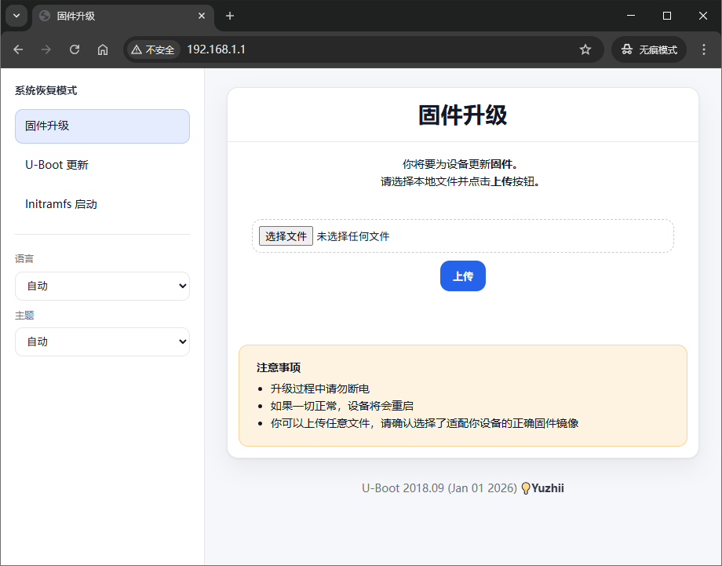

# MediaTek MT7621 U-Boot with Failsafe Mode



A modified version of DragonBluep's u-boot for mt7621 by Yuzhii.

Support functions and Features:

   - Failsafe Mode with Web Recovery Page
   - Support light/dark theme
   - I18n support (English/Chinese)
   - Auto dhcpd server
   - Support Web upgrade U-Boot
   - Can boot Initramfs firmware in Web

Support Actions to build automatically. 

## Online Build

1. Fork This Repository.

2. Click `Actions` then choose `Build customized u-boot`.

3. Click `Run workflow` and set board specific parameters.

4. U-Boot image will be uploaded to Artifacts.

## Local Build

1. Fork This Repository and clone it to local machine.

2. Install required packages:

   - On Ubuntu22.04:

     ```bash
     sudo apt-get install git swig python2-dev
     sudo rm /usr/bin/python
     # create a symlink for python2
     sudo ln -s /usr/bin/python2.7 /usr/bin/python2
     sudo ln -s /usr/bin/python2.7 /usr/bin/python
     ```

     > if you want to change back: `sudo rm /usr/bin/python`, `sudo ln -s /usr/bin/python3 /usr/bin/python`

3. Get toolchain:

   ```bash
   wget -O - https://github.com/DragonBluep/uboot-mt7621/releases/download/20230517/openwrt-toolchain-ramips-mt7621_gcc-12.3.0_musl.Linux-x86_64.tar.xz | tar --xz -xf -
   ```

   > The toolchain directory and U-Boot source directory should be in the same directory

4. Run build script:

   ```bash
   ./build.sh
   ```

Tips:

If you want to build again, after first build, it will edit or generate some files like `include/configs/mt7621-common.h` and `configs/mt7621_build_defconfig`, if you did't develop or edit the uboot, you can use args `git reset --hard HEAD` to remove these change, then build again.

## Board Parameters

**Flash Type**  
NOR Flash / NAND Flash / NAND Flash with NMBM support

**MTD Partition Table**  
example: `192k(u-boot),64k(u-boot-env),64k(factory),-(firmware)`  
notice: `u-boot` and `firmware` partitions are essential

**Kernel Load Address**  
equal to the sum of all partition size before `firmware` in hexadecimal

**Reset Button GPIO**  
GPIO pin number of the reset button  
notice: if not set, you can't press reset button to enter failsafe mode

**System LED GPIO**  
GPIO pin number of the status LED  
notice: if not set, status LED won't blink when you press reset button

**CPU Frequency**  
default value is 880 (MHz).  
notice: Overclock may cause the system to fail to boot or overheat.

**DRAM Frequency**  
default 800 (MT/s) for DDR2 and 1200 (MT/s) for DDR3.  
notice: if your board is unstable, try lowering it.

**Prefered DDR Init Parameters**  
DRAM specific model or type and size  
notice: DDR3-128MiB-KGD is for MT7621DAT (internal integrated 128MiB RAM)

**Use Old DDR Timing Parameters**  
DDR Timing Parameters used in ralink U-Boot 1.1.3  
notice: do not select it if your board is working properly

**Baud Rate**  
TTL serial port baud rate, 57600 or 115200

## Usage

1. Flash `u-boot-mt7621.bin` into board.

2. Set computer network subnet get method to DHCP

3. Remove the power supply, press and hold the reset button, plug in the  
   power supply. And then you can choose:

   a) Release the button after the status LED blinks at least 1 second  
   (blink 5 times), then you will enter into WebUI recovery mode. You can  
   open http://192.168.1.1 in the browser to upload firmware.

   b) Hold the button until the status LED no longer blinks (blink 6 seconds  
   in total), then you will enter into TFTP download mode. You can upload  
   **initramfs** kernel image `recovery.bin` via TFTP server such as tftpd64.
